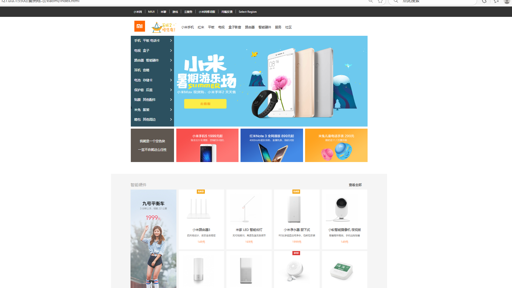

## 一、华为页面
### （一）简介
 通过HTML和CSS将华为商城页面进行初步实现
### （二）编写细节
 1、先按照网页的布局制作大致框架分为几个大模块
 2、在具体的分模块来完成布局
   在进行布局时出现过许多问题，最主要的问题是模块位置调整，由于对一些基础知识的搞混导致出现了很多错误，因此做到一半时又重新对前面的知识进行回顾，发现了CSS盒子模型这个板块的许多知识理解有偏差，经过回顾后再重新进行网页的编写，最终顺利顺利完成页面编写

### （三）页面概览
 
 

## 二、小米页面
为了加强实践能力又制作了小米页面

