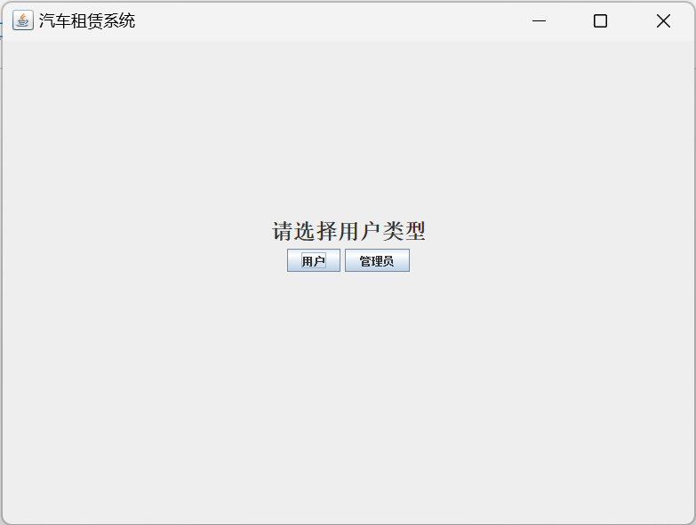
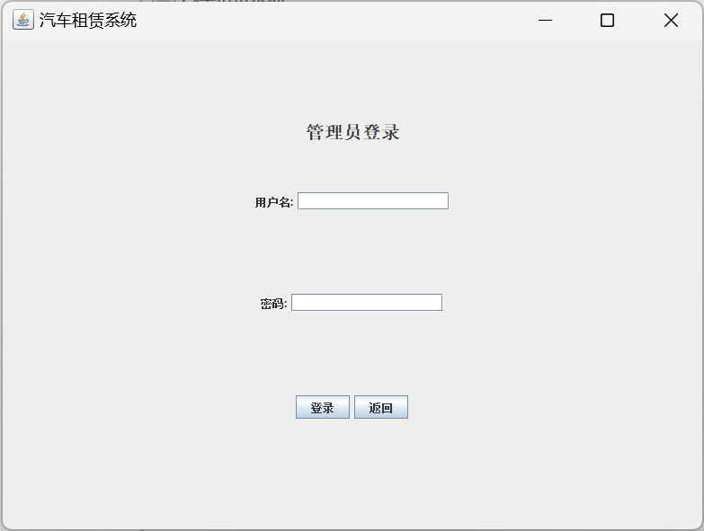
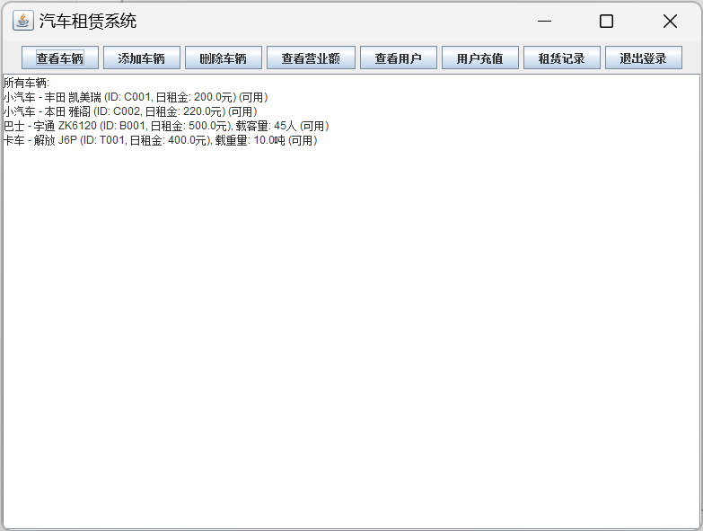
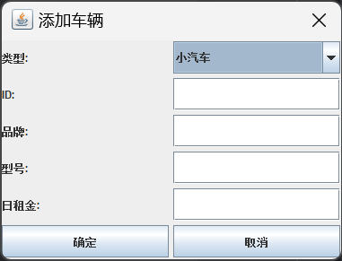
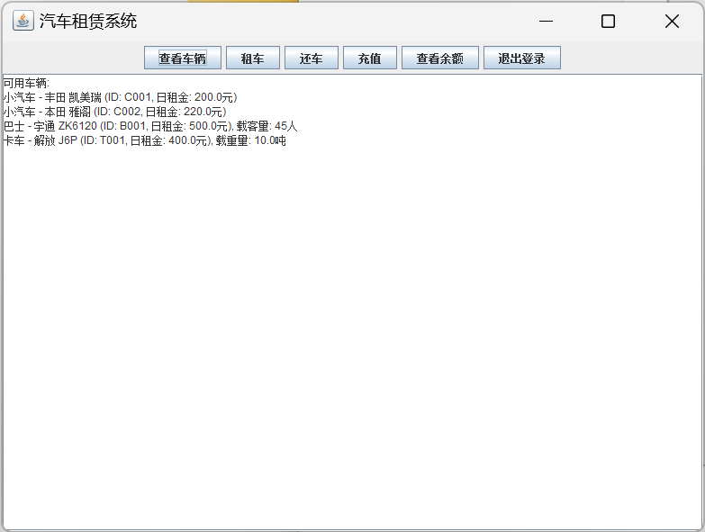
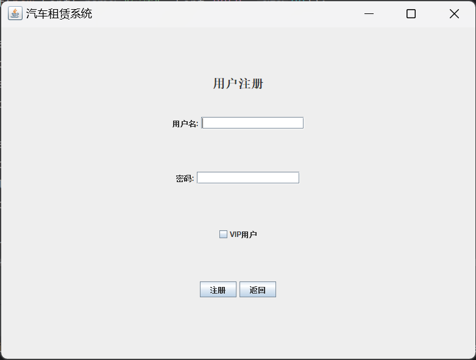

# 汽车租赁系统

## 1.登陆面板

## 2.管理员面板

用户名：admin

密码：admin123

进入系统后点击**查看车辆**可查看现有车辆

点击**添加车辆**可添加自定义的车辆

剩下的按钮也是点击实现对应功能(要么就是弹出对话框，要么就是在下面的文本域打印，比较~~简陋~~，就不一一展示了)

## 3.用户面板

用户名：user1

密码：123456

用户名：vip1

密码：123456

登陆成功后依旧是点击对应按钮(依旧~~简陋~~，不过充值是免费的，你愿意的话可以当当亿万富翁)

## 4.用户注册

(VIP租车九折)

## PS

现在还没有实现数据存储，也就是说现在注册用户，添加车辆等等操作都会在程序关闭后还原，这个就留到后面再解决了
